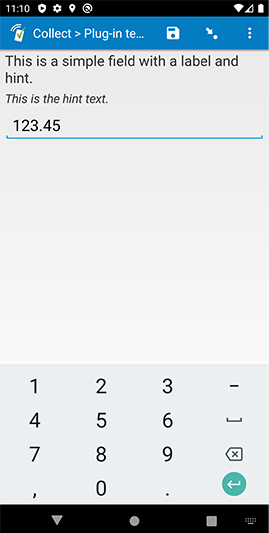

# Baseline decimal field

## Description

A simple replacement for the default *decimal* field, plus a few improvements (see below). You can either download and use this as-is, or you can use it as a starting template when creating your own field plug-in for a *decimal* field.

### Features

In addition to supporting the default SurveyCTO features listed below, this field plug-in offers the following expanded functionality:

1. **Support for RTL languages**  
    If your *label* or *hint* is in a language that uses a right-to-left alphabet (like Arabic), it will be right-justified.
1. **Support for HTML in field references**  
    If you reference another field's value in either the field *label* or field *hint*, and that referenced value contains HTML, the HTML will be correctly rendered.

### Data format

This field plug-in requires the `decimal` field type.

## How to use

### Getting started

**To use this plug-in as-is**, just download the [baseline-decimal.fieldplugin.zip](https://github.com/surveycto/baseline-decimal/raw/master/baseline-decimal.fieldplugin.zip) file from this repo, specify this field plug-in as a custom field appearance in the form design (like in the [test form](https://github.com/surveycto/baseline-decimal/raw/master/extras/test-form/test-form-package.zip)), and attach it to your form. For more details about using field plug-ins, please read the [user documentation](https://docs.surveycto.com/02-designing-forms/03-advanced-topics/06.using-field-plug-ins.html).

**To create your own** field plug-in using this as a template, follow these steps:

1. Fork this repo
1. Make changes to the files in the `source` directory.  
    * **Note:** be sure to update the `manifest.json` file as well.
1. Zip the updated contents of the `source` directory.
1. Rename the .zip file to *yourpluginname*.fieldplugin.zip (replace *yourpluginname* with the name you want to use for your plug-in).
1. You may then attach your new .fieldplugin.zip file to your form as normal.

For more information about developing your own field plug-ins, please read the [developer documentation](https://github.com/surveycto/Field-plug-in-resources).

### Default SurveyCTO feature support

| Feature / Property | Support |
| --- | --- |
| Supported field type(s) | `decimal`|
| Default values | Yes |
| Constraint message | Uses default behavior |
| Required message | Uses default behavior |
| Read only | Yes *(shows the current value, if present)* |
| media:image | Yes |
| media:audio | Yes |
| media:video | Yes |
| `show-formatted` appearance | No |

### Parameters

**Note about the keyboard on iOS:**  
iOS has a less-consistent way of determining which on-screen keyboard to display than Android. If you plan on using this plug-in on iOS, you should test your form on the actual iOS device that you plan on using. If the wrong keyboard appears (for example, if there is no minus button available), you may supply an optional parameter to the plug-in to set the keyboard type manually.

| Parameter key | Parameter value |
| --- | --- |
| `ios-inputmode` | Possible values: `none`, `text`, `decimal`, `numeric`, `tel`, `search`, `email`, `url`. [Click here for more information about the inputmode attibute.](https://css-tricks.com/everything-you-ever-wanted-to-know-about-inputmode)|

## More resources

* **Test form**  
This form will help you explore the differences between this field plug-in and the default text field.  
[Download test form package](https://github.com/surveycto/baseline-decimal/raw/master/extras/test-form/test-form-package.zip)  
[Instructions for test form](/extras/test-form/README.md)

* **Developer documentation**  
Instructions and resources for developing your own field plug-ins.  
[https://github.com/surveycto/Field-plug-in-resources](https://github.com/surveycto/Field-plug-in-resources)

* **User documentation**  
How to get started using field plug-ins in your SurveyCTO form.  
[https://docs.surveycto.com/02-designing-forms/03-advanced-topics/06.using-field-plug-ins.html](https://docs.surveycto.com/02-designing-forms/03-advanced-topics/06.using-field-plug-ins.html)
