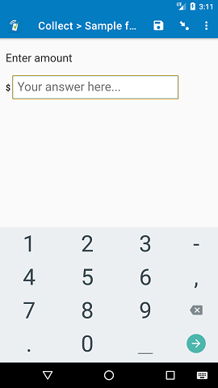

# Format symbol

## Description

This field plug-in is designed to display a symbol either before or after an input field.

### Features

1. Define symbol to be displayed.
1. Choose where the symbol should appear.

This field plug-in also inherits functionality from the [baseline-decimal](https://github.com/surveycto/baseline-decimal) field plug-in.

### Data format

This field plug-in requires the `decimal` field type.

## How to use

### Getting started

**To use this plug-in as-is**

1. Download the [sample form](https://github.com/surveycto/format-symbol/raw/master/extras/test-form/Sample%20form.xlsx) from this repo and upload it to your SurveyCTO server.
1. Download the [format-symbol.fieldplugin.zip](https://github.com/surveycto/format-symbol/raw/master/format-symbol.fieldplugin.zip) file from this repo, and attach it to the sample form on your SurveyCTO server.

### Parameters

| Parameter key | Parameter value |
| --- | --- |
| `symbol` | The symbol to be displayed.|
| `placement` | The positioning of they symbol. This can be take two value:   <ol><li>`start` (default) - the symbol is on the left of the input box. </li><li>`end` - the symbol is on the right of the input box.</li></ol>|

### Example
To display a percent symbol at the end of the textbox, the following would be placed in the appearance column of the spreadsheet form definition:

`custom-format-symbol(symbol='%', placement='end')`

### Default SurveyCTO feature support

| Feature / Property | Support |
| --- | --- |
| Supported field type(s) | `decimal`|
| Default values | Yes |
| Constraint message | Uses default behavior |
| Required message | Uses default behavior |
| media:image | Yes |
| media:audio | Yes |
| media:video | Yes |
| `show-formatted` appearance | No |

## More resources

* **Sample form**   
[Download sample form](https://github.com/surveycto/format-symbol/raw/master/extras/test-form/Sample%20form.xlsx)  

* **Developer documentation**  
Instructions and resources for developing your own field plug-ins.  
[https://github.com/surveycto/Field-plug-in-resources](https://github.com/surveycto/Field-plug-in-resources)

* **User documentation**  
How to get started using field plug-ins in your SurveyCTO form.  
[https://docs.surveycto.com/02-designing-forms/03-advanced-topics/06.using-field-plug-ins.html](https://docs.surveycto.com/02-designing-forms/03-advanced-topics/06.using-field-plug-ins.html)
